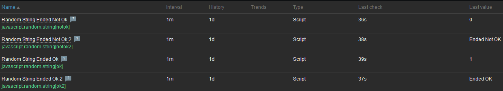
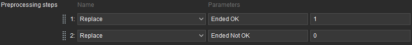
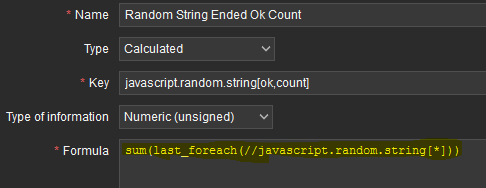
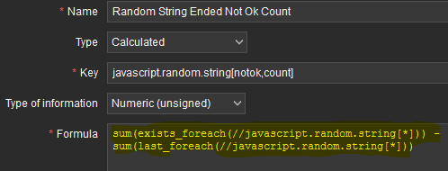
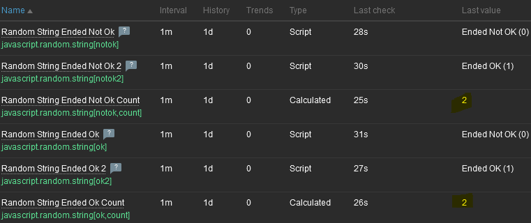

| [↩️ Back](../) |
| --- |

# COUNT UNIQUE STRINGS FROM MULTIPLE ITEMS

Some hosts may have several items that return values that can be aggregated for a general calculation or just for overall observation.

For example, if a Windows host has a system with multiple monitored services that are discovered by the "Windows services discovery" rule, a status item is created for each service. Then, an aggregated item could count how many services are in the "running" or "stopped" state.

Let's say a Linux system has multiple items that retrieve log errors from a system. Each item retrieves a specific error code for alerting purposes. It may be possible to sum the total number of errors from all log items in a given time.

These examples are not number items per se, but could also be needed for aggregations.
Despite the obvious possibilities, Zabbix does not support string aggregation. [According to the documentation](https://www.zabbix.com/documentation/current/en/manual/config/items/itemtypes/calculated/aggregate), "only unsigned integer and float values (type of information) are supported for aggregate calculation items."

In order for a Zabbix system to generate aggreations from strings, a few steps or transformations are required.

<BR>

## Possible benefits

- [X] Observe system or environmental behavior using an aggregated metric;
- [X] Calculate an indicator for a service level objective.

<BR>

## Scenario

Consider a few items that retrieve string values of either "_**Ended OK**_" or "_**Ended Not OK**_". They represent the status of a "Job" from a scheduling system.

<BR>

### 1. Consider the sample below

> [!NOTE]
> For the purposes of this example, the actual collected values are generated by some JavaScript items that randomly generate the two strings values above.

#### Items:

- `Random String Ended Ok`
- `Random String Ended Ok 2`
- `Random String Ended Not Ok`
- `Random String Ended Not Ok 2`



<BR>

The following Javascript function is used for the items.

```javascript
const randomNum = Math.floor(Math.random() * 2);
if (randomNum === 1) {
  return "Ended OK";
} else {
  return "Ended Not OK";
}
```

<BR>

### 2. Just sum the items

A new calculated item could be created to sum up all the items of interest. The most basic syntax is to sum the last value of all items in the calculation using the `last()` function. Something like this:

```
sum(last(//javascript.random.string[ok]),last(//javascript.random.string[ok2]),last(//javascript.random.string[notok]),last(//javascript.random.string[notok2]))
```

<BR>

In terms of numbers, **and for only 4 items**, this is a workable expression. However, these are text items and they are not supported for aggregation. Also, when there are several items, the expression becomes impractical. A Low Level Discovery (LLD) could easily create dozens or hundreds of items. This would make adding the item keys to an expression very labor intensive, not to mention that the LLD could dynamically create and remove items.

> [!NOTE]
> You can actually create a calculated item that sums text items, but Zabbix will display an "_Unsupported item_" error. In my opinion, and in this context, this is the only case where a comprehensive error message is displayed.
>
> For example: \
> _Cannot evaluate expression: function argument "Ended Not OK" is not a numeric value at "sum(last(//javascript.random.string[ok]),last(//javascript.random.string[ok2]),last(//javascript.random.string[notok]),last(//javascript.random.string[notok2]))"_

<BR>

### 3. Creating an aggregated item

For the aggregation to work, the collected values must be converted to a number. Considering that there are 2 possible string values, "_**Ended OK**_" or "_**Ended Not OK**_", they can be converted to binary numbers `1` and `0` by using the `replace` preprocessing step and setting the item's "_Type of information_" to `Numeric (unsigned)`.

> [!TIP]
> _**A value mapping can help to interpret the returned values.**_



<BR>

After converting the items to numbers, we can create a new calculated item that aggregates these numbers.
Instead of using a large expression, we can consolidate it to something smaller.

```
sum(last_foreach(//javascript.random.string[*]))
```



The `last_foreach` function creates an array with the last value of the selected items and, then, the `sum` function adds those values. Only "_**Ended OK**_" values are added in the function, as they have been converted to the number `1`.

<BR>

If it is necessary to count the number of "_**Ended Not OK**_" values, another calculated item must be created.

```
sum(exists_foreach(//javascript.random.string[*])) - sum(last_foreach(//javascript.random.string[*]))
```



This time, the item simply subtracts the total number of status items from the "_**Ended OK**_" items. The `exists_foreach` function returns `1` for each enabled item found, and again the `sum` function adds these values together.

<BR>

### 3. The resulting aggreation

Finally, the resulting values are aggregated and ready for observation.



<BR>

> _What if there are more than 2 possible values to be aggregated? \
> to be continued..._

<BR>

| [⬆️ Top](#count-unique-strings-from-multiple-items) |
| --- |
