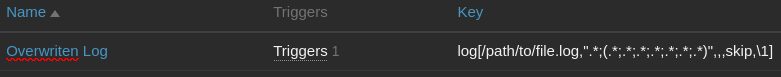
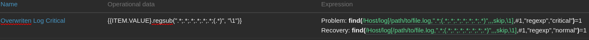
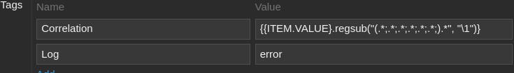
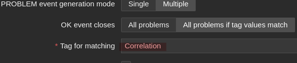
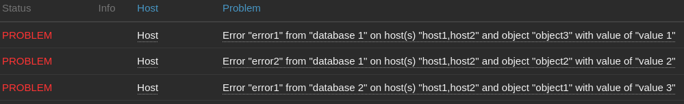
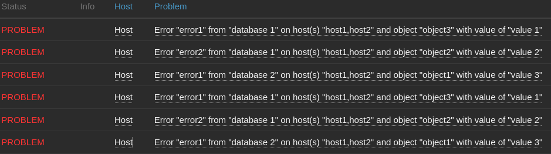
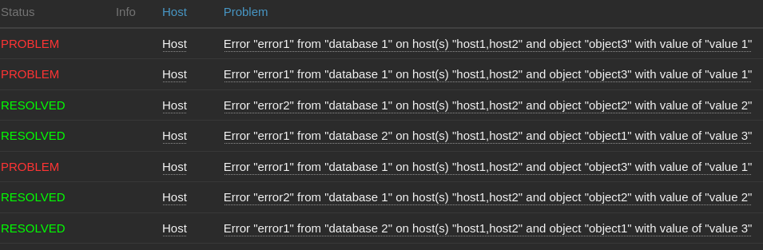
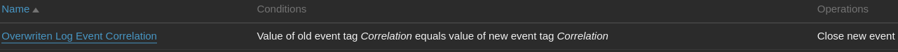
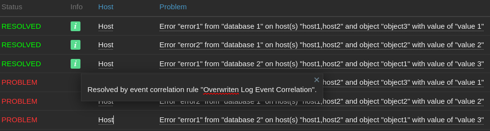

| [↩️ Back](./) |
| --- |

# Overwritten Log File

A log is generally an append-only, ordered sequence of entries stored in a file that records when and what happened to a system. It often comes with a sequence number and a timestamp for each entry, defining a notion of "_time_". Typically, an application log is intended to be read primarily by humans, although it is usually impractical.

Zabbix can be used for centralized log monitoring, which can help to investigate outages, troubleshoot bugs, or analyze incidents. Logs offer more than just troubleshooting, as they help to track behavior, plan capacity, audit compliance, and provide business insights, among other things. So it is important to monitor logs, even if they are not standard.

<BR>

## Context

One scenario found in production environments is when logs are overwritten, since not all logs have incremental entrys and may be overwritten from time-to-time (_not refering to rotation_). Whether this is a real log file or not, is not a topic for today. Therefore, some logs may be re-created at regular intervals, and the contents are overwritten each time, meaning the file is not incremental. In this case, standard log monitoring may not be sufficient.

> _**For the sake of simplicity, and to relate to the Zabbix concept of log monitoring, this article will use the term "_log_" to describe a regularly overwritten file.**_

<BR>

## Consequences

When a log file is incremented, new records can be read and analyzed by Zabbix since the last modification time. However, when a log is overwritten, already captured records may reapper and be captured again by Zabbix. This can replicate unnecessary records in the database.

The situation can be made worse if a record matches a trigger expression, as this generates an event. If the trigger "event generation mode" is set to `multiple` and the same previous record is overwritten, multiple events can be generated for the same record. This makes it possible to _spam_ Zabbix with repeated events.

<BR>

## Scenario

Consider a log file with a CSV content that is created by a scheduled script and overwritten each time it is run. This means that the same data is constantly being written to the log file over and over again, with only the timestamp changing. The following content is a good example.

```csv
20240813 21:55:49;error1;database 2;backup;object1;value 3;host1,host2;normal
20240813 21:55:49;error2;database 1;backup;object2;value 2;host1,host2;normal
20240813 21:55:49;error1;database 1;other;object3;value 1;host1,host2;critical
(...)
```

<BR>

Now, let us create a simple log item that retrieves all the file data without the timestamp. This is done by creating a log item that uses a regular expression to remove the timestamp, which is the first CSV column. Whenever the file is rewritten, the Zabbix Agent should capture all the file entry lines one by one and send them as a batch to the Zabbix Server.

```
log[/path/to/file.log,".*;(.*;.*;.*;.*;.*;.*;.*)",,,skip,\1]
```



<BR>

The goal is to create an event whenever a record with the string `critical`  appears in a log entry. Therefore, a trigger is created to generate an event for each line with a severity of `critical`. Next is the problem expression for the trigger.

```
find(/host/log[/path/to/file.log,".*;(.*;.*;.*;.*;.*;.*;.*)",,,skip,\1],1#,"regexp","critical")=1
```

To resolve the event, the trigger should find the same previous log entry that generated an event, this time with the `normal` string. A trigger recovery expression is then set.

```
find(/host/log[/path/to/file.log,".*;(.*;.*;.*;.*;.*;.*;.*)",,,skip,\1],1#,"regexp","normal")=1
```

The configured trigger looks like this:



<BR>

The logic is that once an event is generated by the above trigger, the next time the file is overwritten, it should **not** generate a new event if the same log line is written again with a severity of `critical`. **Only if the same line is written to the log file with a severity of `normal` should the event be resolved.**

<BR>

## Events

Let us continue with the example. The following line appears in the log file with a severity of `critical` in the 8th column, so an event should be created.

```csv
20240813 21:55:49;error1;database 1;other;object3;value 1;host1,host2;critical
```

Ignoring the timestamp, if the exact same line is repeated in the log file with a severity of `critical`, only the first event should remain open. New events should not be created because the first one is already open. However, if the same line with the same data appears after a few cycles with a `normal` severity, the event should be resolved.

```csv
20240813 22:30:09;error1;database 1;other;object3;value 1;host1,host2;normal
```

<BR>

For such a scenario, [trigger-based event correlation](https://www.zabbix.com/documentation/current/en/manual/config/event_correlation/trigger) is required to resolve the events. Remember that the trigger "event generation mode" is set to `multiple`.

The trigger should have a correlation tag that is given a unique value from the log entry. In this scenario, [macro functions](https://www.zabbix.com/documentation/current/en/manual/config/macros/macro_functions) help to extract such values. In the example, the tag is named `Correlation` with a value of  `{{ITEM.VALUE}.regsub("(.*;.*;.*;.*;.*;.*;).*", "\1")}`. This macro function will retrieve all CSV columns except the last one.



Also, the trigger is configured to resolve the event based on the `Correlation` tag.



<BR>

## The issue

The trigger-based correlation works and new events are resolved correctly when the event tag matches new log entries with the `normal` string. The problem is that when the same log entry is repeated with the `critical` string, new events are created. This behavior can potentially spam Zabbix with multiple repeated events.

To demonstrate this, consider the following initial content of the log file.

```
20240814 20:14:34;error1;database 2;backup;object1;value 3;host1,host2;critical
20240814 20:14:34;error2;database 1;backup;object2;value 2;host1,host2;critical
20240814 20:14:34;error1;database 1;other;object3;value 1;host1,host2;critical
```

This generates 3 events.



When the log is overwritten, new events are created, even if the content is the same (except for the timestamp).

```
20240814 20:22:56;error1;database 2;backup;object1;value 3;host1,host2;critical
20240814 20:22:56;error2;database 1;backup;object2;value 2;host1,host2;critical
20240814 20:22:56;error1;database 1;other;object3;value 1;host1,host2;critical
```



If the entries match the `normal` string, the matching correlation tag resolves the corresponding events.

```
20240814 20:31:22;error1;database 2;backup;object1;value 3;host1,host2;normal
20240814 20:31:22;error2;database 1;backup;object2;value 2;host1,host2;normal
20240814 20:31:22;error1;database 1;other;object3;value 1;host1,host2;critical
```

In this example, 2 entries now have the `normal` string and will resolve the corresponding events. However, 1 entry remains with the `critical` string and it will trigger another event.



<BR>

## Global correlation

We see that a trigger-based correlation is not enough to handle this scenario. A [global event correlation rule](https://www.zabbix.com/documentation/7.0/en/manual/config/event_correlation/global?hl=correlation) is needed then. It will define "_how the new problem events are paired with existing problem events and what to do in case of a match_".

**Carefully considering the event tags**, the rule may look something like this:



It will close new repeating events immediately.



One consideration is that the global correlation rule allows new events to be created. In reality, this is not an optimal solution. A best option would be not to create new events, but this option is not available at the time of this writing. In the end, this is all a contour solution. Nevertheless, it does solve the problem of multiple recurring open events.

<BR>

| [⬆️ Top](#overwritten-log-file) |
| --- |