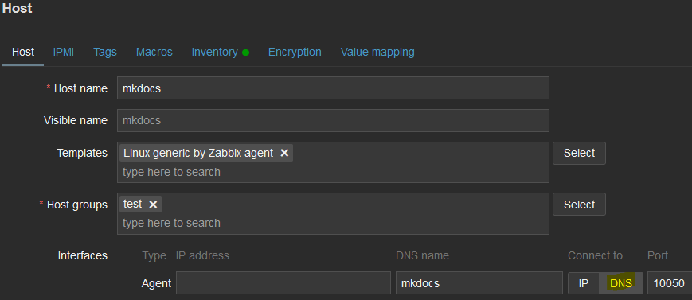

| [↩️ Back](../) |
| --- |

# Analysis of Zabbix DNS Queries

It [has been noticed that Zabbix Server and Zabbix Agent](https://www.zabbix.com/forum/zabbix-troubleshooting-and-problems/418158-lots-of-dns-querys-from-zabbix-agent) generate many DNS requests when using domain names for hosts. This is an [old undesirable behavior that has been around](https://www.zabbix.com/forum/zabbix-help/28694-zabbix-is-generating-a-lot-of-dns-requests) for a long time, and unfortunately, there seems to be no fix for it yet.

This is a detailed analysis of the behavior of the Zabbix Server and Agent when using hostname or domain name address in the host interface configuration.

<BR>

## Context

If a monitored host is configured with a DNS name as its interface, Zabbix Server will start querying this name too often, even if the host has a reasonable update interval for its items. Once the host is configured with its DNS name, the Server starts making at least 2 queries for each item it updates. Thus, the number of queries can increase quickly if the host has many items.

The same applies to the Zabbix Agent. If the `Server` or `ServerActive` parameter is set up to a hostname/domain name, the Agent queries the DNS server too many times.

This is most likely due to a lack of DNS caching by Zabbix processes, and we can easily observe a DNS server query log and see how many queries Zabbix makes.


<BR>

## Consequences

The local DNS server shows many requests made from the Zabbix Server to a monitored host in the network, or vice-versa if the Agent is configured with a DNS name. Following the DNS log, a large number of constant DNS queries for A and AAAA records are found.

If the Server is configured with DNS names for many monitored hosts, or if such monitored hosts are configured with the Server's DNS name, it is possible to overload the DNS server with too many queries and flood its file system with logs. This behavior can consume a significant amount of DNS server resources. Also, some DNS providers with rate limits may drop name lookups, resulting in an unreliable monitoring.

The larger the monitoring environment, the greater the impact on DNS. More robust DNS servers may not suffer much, but lower-end DNS systems may have a hard time handling this many requests.

<BR>

## Response so far

We can trace back this behavior to October 2011 when [issue ZBXNEXT-1002](https://support.zabbix.com/browse/ZBXNEXT-1002) was reported to Zabbix SIA. It still has an unresolved status.

Unfortunately, one of the [responses from a support developer](https://support.zabbix.com/browse/ZBXNEXT-1002?focusedId=75089&page=com.atlassian.jira.plugin.system.issuetabpanels:comment-tabpanel#comment-75089) is "_caching domain names has no place to be within ZABBIX applications_".

As you can see, Zabbix does not deal with DNS requests and these are handled to the operating system or caching system. Still, Zabbix certainly requests a lot. So, one can judge the answer as inadaquate, as it is clear that many users rely on Zabbix to monitor large environments, and cannot let the monitoring system to overload their DNS servers.

<BR>

## Reproducing the issue

To reproduce the issue, an environment was set up with 2 hosts, one for the Zabbix Server and another as a monitored host with a Zabbix Agent. Both are running version `6.4.14` and Oracle Linux 9.4.

The templates used to test "passive" and "active" monitoring are `Linux generic by Zabbix agent` and `Linux generic by Zabbix agent active`, respectively. All items are normalized to have a minimum update interval of 1 minute.

Follow the steps below to observe the unwanted behavior.

### Zabbix Server

**1.** Add a host with a DNS name as the Agent interface and attach a template so that a few items are included.



**2.** As soon as the Server starts pulling data from the monitored host, the DNS server log is filled with queries. Note in the snippet below that there are 10 queries in 1 minute.


**3.** In this scenario, the Server generates 2 requests for each item it collects data from. If 5 items have a 1 minute update interval, then 10 requests will be sent to the DNS server every minute.

<BR>

### Zabbix Agent Passive

**1.** Configure the Zabbix Agent with the Server DNS name on the `Server` parameter. This will allow the agent to accept passive checks from the Server.


**2.** As soon as the Zabbix Agent is started, new requests to the DNS server start popping up in the same manner as the Server.


**3.** Despite the passive configuration, the Agent requests the IP address of the Server again for each item.

<BR>

### Zabbix Agent Active

**1.** Now let us set the Agent to work in active mode, using a domain name in the `ServerActive` parameter. In this example, the monitored host has the same number of active items as in the previous example. However, it appears that the Agent is doubling the number of requests to the DNS server.


**2.** We can see 20 requests in the span of 1 minute.

<BR>

## Workarounds

At the time of this writing, no fix has been released for Zabbix regarding this issue. So some options may help to reduce the number of DNS queries from Zabbix applications.

<BR>

### Domain Name to IP Address

The most obvious workaround is to replace the domain name with the corresponding IP address. For the Zabbix Server this should be done in the host configuration where the interface is set to "IP Address". For the Zabbix Agent, the `Server` or `ServerActive` parameters must be set to an IP addresses. This will eliminate the need for DNS lookups.

<BR>

### Hosts File

Another option is to set the hostname of the Server in the `hosts` file. This is mainly for monitored hosts, as it may be impractical to maintain a large `hosts` file in the Zabbix Server.

Basically, you can append a new line to the `/etc/hosts` file of the monitored host. For example:

```shell
echo '192.168.7.12 zabbixserver.domain.name' >> /etc/hosts
```

From then on, the Agent will perform a name lookup in the `hosts` file first.

<BR>

### Local caching system

If the host supports it, it is possible to include a local DNS caching system to prevent it from making too many requests.

> **⚠️**
> **Despite the benefits of such systems, it seems that [some applications can bypass](https://access.redhat.com/solutions/916353) the host's cache, and Zabbix may be one of them. This is unconfirmed for Zabbix and could not be validated. However, the tests below show that it may be true.**

<BR>

#### 1. NSCD

The [Name Service Cache Daemon (NSCD)](https://www.gnu.org/software/libc/) is a common choice for server administrators. By caching these frequently accessed lookups, NSCD helps improve the system performance by reducing the number of queries sent to the DNS server.

To install NSCD, it is recommended to use the OS package manager, as most Linux distributions provide the application in their repository.

```shell
dnf install -y nscd
```

After installing NSCD, [the default configuration file](https://linux.die.net/man/5/nscd.conf) is located in `/etc/nscd.conf` and it should be customized to ensure that it works optimally in your environment. For more help, see `man 5 nscd.conf`.

To start NSCD, use the SystemD service manager.

```shell
systemctl enable --now nscd
```

> _While testing, with the system active and caching, the Zabbix Agent kept resquesting the Server's name to the DNS server._

<BR>

#### 2. Systemd-resolved

[Systemd-Resolved](https://systemd.io/RESOLVED-VPNS/) is a system service that provides network name resolution and caching for local applications.

It is available in the repositories of many Linux distributions. To install it, use the OS package manager.

```shell
dnf install -y systemd-resolved
```

The [main configuration file](https://www.freedesktop.org/software/systemd/man/latest/systemd-resolved.service.html) is located at `/etc/systemd/resolved.conf` and it should be customized to ensure that it works optimally in your environment.

To start Systemd-resolved, use the SystemD service manager.

```shell
systemctl enable --now systemd-resolved
```

> _While testing, with the system active and caching, the Zabbix Agent kept resquesting the Server's name to the DNS server._

<BR>

| [⬆️ Top](#analysis-of-zabbix-dns-queries) |
| --- |