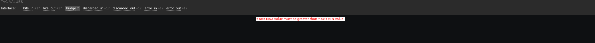
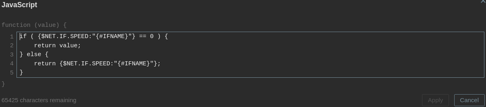
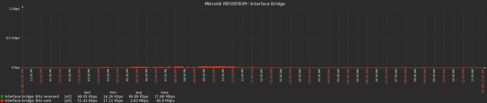

| [↩️ Back](./) |
| --- |

# CHANGE OBJECT VALUES WITH MACROS

Sometimes items may pull data that is inaccurate or incorrect. This can happen for many reasons, including configuration errors, bugs, or unexpected behavior of the monitored object. When this happens, it is best to fix the data at the source, but this is not always possible. Even if the solution is known, the monitored objected may have restricted access, or there may be no communication with the maintainers. Or it may simply be a bug that the vendor has not yet fixed. Other times, it may be necessary to manipulate data without changing the source configuration.

To help manipulate object values, a **hard override** can be applied to the monitored object, where the **source data is changed based on [user macros with context][user_macro] and [Javascript preprocessing][javascript_preprocessing]**.

> ⚠️ **Note that that applying this override is a possible workaround solution, and does not replace a permanent fix to the source data.**

<BR>

## Reference

- Inspired by [Aigars Kadikis YouTube channel](https://www.youtube.com/watch?v=-CHX1asghyQ)

<BR>

## Possible benefits

- [X] Manipulate item values from macros;
- [X] Avoid false positives;
- [X] Fix incorrect source values;

<BR>

## Syntax

```javascript
if ( {$MACRO.NAME:"CONTEXT"} == 0 ) {
    return value;
} else {
    return {$MACRO.NAME:"CONTEXT"};
}
```

The `{$MACRO.NAME:"CONTEXT"}` represents the user macro name (`$MACRO.NAME`) with a context (`CONTEXT`) appended.

This code is a simple yet effective example of how to change the value of an item based on a [user macro with context][user_macro]. The item value is only changed if the context on the host macro matches the item context and the macro value is not `0`.

#### Basically

```
If the macro has a value of 0,
    the javascript will not change the item.
However, if the macro has a value other than 0,
    the item takes whatever value the macro has.
```

💡 **It is also possible to use a more flexible context with regular expressions. This can be useful if the value you want changed has some specific target expressions.**

<BR>

## Example scenario

Many network devices allow you to manually configure an Ethernet interface speed, and sometimes it is misconfigured, or the automatic configuration has a mismatch. However, for whatever reason, it is not always possible to fix this misconfiguration. So, this macro override can be applied.

#### 1. Consider a Zabbix item that collects an Ethernet interface speed value of `0 Gbps`.

For some reason, a device is reporting a speed of `0` for the `bridge` interface and this is interfering with the Zabbix interface graph. The interface speed should be the Y-axis max value on the graph, but because it is `0`, Zabbix displays an error.



<BR>

#### 2. Now, a user macro with a context can be created on the host level

The `{$NET.IF.SPEED}` macro is included at the **template level** with a value of `0` so that all interfaces can use this override, but only those with a value other than `0` will actually be overridden.


The `{$NET.IF.SPEED:"bridge"}` macro with context is then created at the **host level** so that the Javascript preprocessing script is applied with the specific `bridge` context. This indicates that only the interface named `bridge` will be overridden, causing the interface speed item to assume the macro value.


<BR>

#### 3. A Javascript preprocessing script is added to the item

For this example, the script is included in the `Interface {#IFNAME}: Speed` item prototype from the `Network interfaces discovery` LLD. The item gets a new preprocessing step with the following Javascript, which expects the user macro with a context.

```javascript
if ( {$NET.IF.SPEED:"{#IFNAME}"} == 0 ) {
    return value;
} else {
    return {$NET.IF.SPEED:"{#IFNAME}"};
}
```



After an LLD cycle, the item is updated and starts using the macro value.


Now the iterface graph no longer shows an error and uses the macro configured speed as the Y-axis max value.



<BR>

| [⬆️ Top](#change-object-values-with-macros) |
| --- |

[user_macro]: https://www.zabbix.com/documentation/current/en/manual/config/macros/user_macros_context
[javascript_preprocessing]: https://www.zabbix.com/documentation/current/en/manual/config/items/preprocessing/javascript