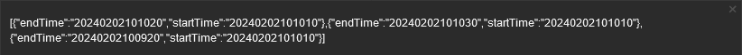
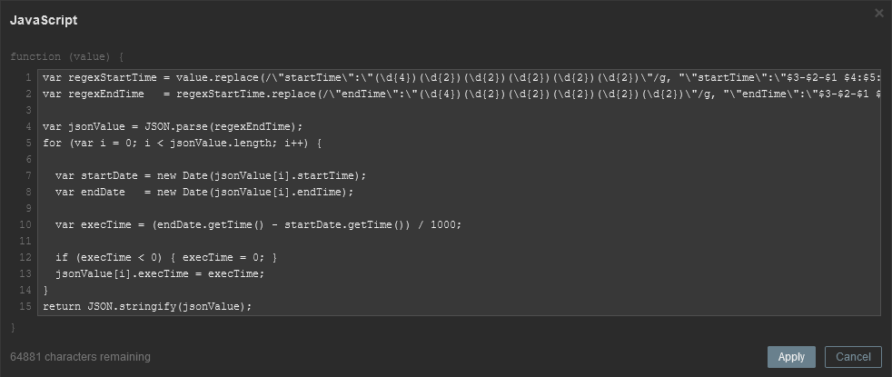
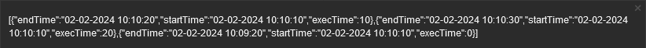

| [↩️ Back](./) |
| --- |

# CHANGE OBJECT VALUES WITH MACROS

Sometimes items may pull data that is inaccurate or incorrect. This can be due to many reasons, such as configuration errors, bugs, or unexpected behavior of the monitored object. When this happens, it is best to fix the data at the source, but this is not always possible. Even if the solution is known, the monitored objected may have restricted access, or there may be no communication with the maintainers. Other times, it is simply a bug that the vendor has not yet fixed.

To help manipulate object values, a **hard override** can be applied to the monitored object, where the **source data is changed based on [user macros with context][user_macro] and [Javascript preprocessing](https://www.zabbix.com/documentation/current/en/manual/config/items/preprocessing/javascript)**.

> ⚠️ **Note that that applying this "override" is a possible workaround solution, and does not replace a permanent fix to the source data.**

<BR>

## Reference

- From [Aigars Kadikis YouTube channel](https://www.youtube.com/watch?v=-CHX1asghyQ)

<BR>

## Possible benefits

- [X] Manipulate item values from macros;
- [X] Avoid false positives;
- [X] Fix incorrect source values;

<BR>

## Syntax

```javascript
if ( {$MACRO.NAME:"CONTEXT"} == 0 ) {
    return value;
} else {
    return {$MACRO.NAME:"CONTEXT"};
}
```

The `{$MACRO.NAME:"CONTEXT"}` represents the user macro name (`$MACRO.NAME`) with a context (`CONTEXT`) appended.

This code is a simple yet effective way to change the value of an item based on a [user macro with context][user_macro]. The item value is only changed if the item context matches the macro context, and the macro value is different than `0`.

#### Basically

```sql
If the macro has a value of 0,
    the javascript will not change the item.
However, if the macro has a value other than 0,
    the item takes whatever value the macro has.
```

<BR>


## Example

Consider a Zabbix item that collects a JSON array with properties that represent a process start time and end time.

> [!NOTE]
> The actual collected value is passed to the JavaScript preprocessing step as a textual string.

<BR>

### 1. Consider the sample value below.
> [!TIP]
> Avoid prettifying the data while testing it with Zabbix JavaScript.

```json
[
    {
    "endTime": "20240202101020",
    "startTime": "20240202101010"
    },
    {
    "endTime": "20240202101030",
    "startTime": "20240202101010"
    },
    {
    "endTime": "20240202100920",
    "startTime": "20240202101010"
    }
]
```

<BR>

**Zabbix passes the value as a string, i.e. the input value of the preprocessing step looks more like this:**
```json
[{"endTime":"20240202101020","startTime":"20240202101010"},{"endTime":"20240202101030","startTime":"20240202101010"},{"endTime":"20240202100920","startTime":"20240202101010"}]
```



<BR>

### 2. In this example, the `startTime` and `endTime` can be used to calculate the execution time for each process.

Notice that this JSON has several objects that represent a system process. The objects do not have an execution time property. Therefore, by using a JavaScript preprocessing step, we can calculate this execution time using the `startTime` and `endTime` strings and add this new value to the object.

#### Let's use the proposed code and add a few operations to accomplish this task.

```javascript
var regexStartTime = value.replace(/\"startTime\":\"(\d{4})(\d{2})(\d{2})(\d{2})(\d{2})(\d{2})\"/g, "\"startTime\":\"$3-$2-$1 $4:$5:$6\"");
var regexEndTime   = regexStartTime.replace(/\"endTime\":\"(\d{4})(\d{2})(\d{2})(\d{2})(\d{2})(\d{2})\"/g, "\"endTime\":\"$3-$2-$1 $4:$5:$6\"");

var jsonValue = JSON.parse(regexEndTime);
for (var i = 0; i < jsonValue.length; i++) {

  var startDate = new Date(jsonValue[i].startTime);
  var endDate   = new Date(jsonValue[i].endTime);

  var execTime = (endDate.getTime() - startDate.getTime()) / 1000;

  if (execTime < 0) { execTime = 0; }
  jsonValue[i].execTime = execTime;
}
return JSON.stringify(jsonValue);
```



<BR>

#### Here's what each piece of the code does:

a. The code starts by using regular expressions to manipulate the passed `value` string. It replaces occurrences of `startTime` and `endTime` into a more readable format. It goes from `YYYYMMDDHHmmss` to `YYYY-MM-DD HH:mm:ss`.

b. Next, the modified string (`regexEndTime`) is parsed into a JavaScript object using `JSON.parse()`. The resulting object is stored in the `jsonValue` variable.

c. A loop iterates through each element in `jsonValue`. \
For each element, it creates "_Date_" variables from the `startTime` and `endTime` values. Calculates the execution time (in seconds) as the difference between `endTime` and `startTime`. If the calculated `execTime` is negative, it sets it to `0`. Finally, the `execTime` property is added to the `jsonValue` variable.

d. The code returns the modified `jsonValue` object as a JSON string using `JSON.stringify()`.

<BR>

### 3. The resulting value is a JSON string with the `execTime` property.

```json
[
    {
    "endTime": "02-02-2024 10:10:20",
    "execTime": 10,
    "startTime": "02-02-2024 10:10:10"
    },
    {
    "endTime": "02-02-2024 10:10:30",
    "execTime": 20,
    "startTime": "02-02-2024 10:10:10"
    },
    {
    "endTime": "02-02-2024 10:09:20",
    "execTime": 0,
    "startTime": "02-02-2024 10:10:10"
    }
]
```



<BR>

| [⬆️ Top](#add-properties-into-json-objects) |
| --- |

[user_macro]: https://www.zabbix.com/documentation/current/en/manual/config/macros/user_macros_context