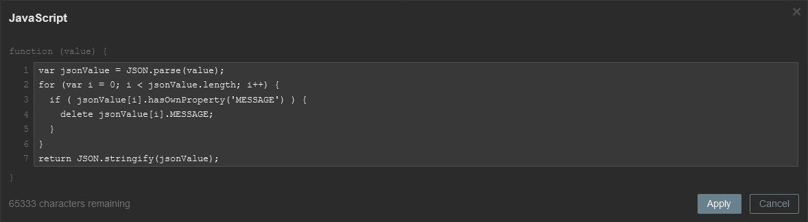
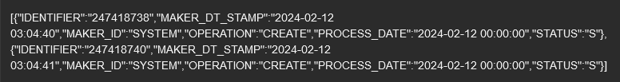

| [↩️ Back](./) |
| --- |

# REMOVE PROPERTIES FROM JSON OBJECTS

JSON data is perfect for creating dependent items. However, sometimes the raw JSON is unprepared for processing. So, JavaScript preprocessing can be used to remove object properties from the collected data. This can have some advantages depending on your scenario.

<BR>

## Possible benefits

- Shrink the data before storing it in the database;
- Reduce overall processing.

<BR>

## Syntax

```javascript
var jsonValue = JSON.parse(value);
for (var i = 0; i < jsonValue.length; i++) {
  if ( jsonValue[i].hasOwnProperty('KEY') ) {
    delete jsonValue[i].MESSAGE;
  }
}
return JSON.stringify(jsonValue);
```

This code is a simple yet effective way to remove properties from JSON objects.
Remember to change the **`KEY`** value to your own key name.
You can also repeat the `if` statement to remove multiple keys.

<BR>

## Example

Consider a Zabbix item that collects a JSON array. The actual collected value is passed to the JavaScript preprocessing step as a textual string.

### 1. Consider the sample value below.
> [!TIP]
> Avoid prettifying the data while testing it with Zabbix JavaScript.

```json
[
  {
  "IDENTIFIER": "247418738",
  "MAKER_DT_STAMP": "2024-02-12 03:04:40",
  "MAKER_ID": "SYSTEM",
  "MESSAGE": "<?xml version=\"1.0\"?>\n<ENV xmlns=\"http://TEST.com/service/TEST\">\n <HEADER>\n <SOURCE>TEST</SOURCE>\n <UBSCOMP/>\n <USERID>TEST</USERID>\n <BRANCH>TEST</BRANCH>\n <MODULEID>AC</MODULEID>\n <SERVICE>TEST</SERVICE>\n <OPERATION>Entry</OPERATION>\n <DESTINATION>TEST</DESTINATION>\n <MSGSTAT>SUCCESS</MSGSTAT>\n </HEADER>\n <BODY>\n <CO-Entry>\n <ACTION>CREATE</ACTION>\n <TRNREFNO>TESTXPAL000000000</TRNREFNO>\n <BRN>TEST</BRN>\n <CUSTOMER_NO>000000000</CUSTOMER_NO>\n <ACC_OR_GL_NO>8000000111</ACC_OR_GL_NO>\n <CURRENCY>ANY</CURRENCY>\n <TYPE>A</TYPE>\n <DRCRIND>C</DRCRIND>\n <AMOUNT>532.69</AMOUNT>\n <VALDATE>12-FEB-2024</VALDATE>\n </CO-Entry>\n </BODY>\n</ENV>\n",
  "OPERATION": "CREATE",
  "PROCESS_DATE": "2024-02-12 00:00:00",
  "STATUS": "S"
  },
  {
  "IDENTIFIER": "247418740",
  "MAKER_DT_STAMP": "2024-02-12 03:04:41",
  "MAKER_ID": "SYSTEM",
  "MESSAGE": "<?xml version=\"1.0\"?>\n<ENV xmlns=\"http://TEST.com/service/TEST\">\n <HEADER>\n <SOURCE>TEST</SOURCE>\n <UBSCOMP/>\n <USERID>TEST</USERID>\n <BRANCH>TEST</BRANCH>\n <MODULEID>AC</MODULEID>\n <SERVICE>TEST</SERVICE>\n <OPERATION>Entry</OPERATION>\n <DESTINATION>TEST</DESTINATION>\n <MSGSTAT>SUCCESS</MSGSTAT>\n </HEADER>\n <BODY>\n <CO-Entry>\n <ACTION>CREATE</ACTION>\n <TRNREFNO>2404001335289000</TRNREFNO>\n <BRN>TEST</BRN>\n <CUSTOMER_NO>000000000</CUSTOMER_NO>\n <ACC_OR_GL_NO>8000000111</ACC_OR_GL_NO>\n <CURRENCY>ANY</CURRENCY>\n <TYPE>A</TYPE>\n <DRCRIND>D</DRCRIND>\n <AMOUNT>15</AMOUNT>\n <VALDATE>12-FEB-2024</VALDATE>\n </CO-Entry>\n </BODY>\n</ENV>\n",
  "OPERATION": "CREATE",
  "PROCESS_DATE": "2024-02-12 00:00:00",
  "STATUS": "S"
  }
]
```

<BR>

#### Zabbix passes the value as a string, i.e. the input value of the preprocessing step looks more like this:
```json
[{"IDENTIFIER":"247418738","MAKER_DT_STAMP":"2024-02-12 03:04:40","MAKER_ID":"SYSTEM","MESSAGE":"<?xml version=\"1.0\"?>\n<ENV xmlns=\"http://TEST.com/service/TEST\">\n <HEADER>\n <SOURCE>TEST</SOURCE>\n <UBSCOMP/>\n <USERID>TEST</USERID>\n <BRANCH>TEST</BRANCH>\n <MODULEID>AC</MODULEID>\n <SERVICE>TEST</SERVICE>\n <OPERATION>Entry</OPERATION>\n <DESTINATION>TEST</DESTINATION>\n <MSGSTAT>SUCCESS</MSGSTAT>\n </HEADER>\n <BODY>\n <CO-Entry>\n <ACTION>CREATE</ACTION>\n <TRNREFNO>TESTXPAL000000000</TRNREFNO>\n <BRN>TEST</BRN>\n <CUSTOMER_NO>000000000</CUSTOMER_NO>\n <ACC_OR_GL_NO>8000000111</ACC_OR_GL_NO>\n <CURRENCY>ANY</CURRENCY>\n <TYPE>A</TYPE>\n <DRCRIND>C</DRCRIND>\n <AMOUNT>532.69</AMOUNT>\n <VALDATE>12-FEB-2024</VALDATE>\n </CO-Entry>\n </BODY>\n</ENV>\n","OPERATION":"CREATE","PROCESS_DATE":"2024-02-12 00:00:00","STATUS":"S"}, {"IDENTIFIER":"247418740","MAKER_DT_STAMP":"2024-02-12 03:04:41","MAKER_ID":"SYSTEM","MESSAGE":"<?xml version=\"1.0\"?>\n<ENV xmlns=\"http://TEST.com/service/TEST\">\n <HEADER>\n <SOURCE>TEST</SOURCE>\n <UBSCOMP/>\n <USERID>TEST</USERID>\n <BRANCH>TEST</BRANCH>\n <MODULEID>AC</MODULEID>\n <SERVICE>TEST</SERVICE>\n <OPERATION>Entry</OPERATION>\n <DESTINATION>TEST</DESTINATION>\n <MSGSTAT>SUCCESS</MSGSTAT>\n </HEADER>\n <BODY>\n <CO-Entry>\n <ACTION>CREATE</ACTION>\n <TRNREFNO>2404001335289000</TRNREFNO>\n <BRN>TEST</BRN>\n <CUSTOMER_NO>000000000</CUSTOMER_NO>\n <ACC_OR_GL_NO>8000000111</ACC_OR_GL_NO>\n <CURRENCY>ANY</CURRENCY>\n <TYPE>A</TYPE>\n <DRCRIND>D</DRCRIND>\n <AMOUNT>15</AMOUNT>\n <VALDATE>12-FEB-2024</VALDATE>\n </CO-Entry>\n </BODY>\n</ENV>\n","OPERATION":"CREATE","PROCESS_DATE":"2024-02-12 00:00:00","STATUS":"S"}]
```


<BR>

### 2. In this example, the `MESSAGE` property has a very large XML value that is unnecessary to store in Zabbix DB.

Imagine that this JSON has several objects and the item is collecting them every minute. This could result in a lot of wasted storage in the database's "_history_" table. By using a JavaScript preprocessing step, we could remove the `MESSAGE` property from each JSON object to reduce the amount of data stored in the database.

Let's add the proposed code to accomplish this task.

```javascript
var jsonValue = JSON.parse(value);
for (var i = 0; i < jsonValue.length; i++) {
  if ( jsonValue[i].hasOwnProperty('MESSAGE') ) {
    delete jsonValue[i].MESSAGE;
  }
}
return JSON.stringify(jsonValue);
```



<BR>

#### Here's what each piece of the code does:

a. `var jsonValue = JSON.parse(value);` \
The `jsonValue` variable stores the JSON-formatted string `value` as a JavaScript object by using the `JSON.parse()` method.

b. `for (var i = 0; i < jsonValue.length; i++) { ... }` \
This is a `for` loop that iterates over each element in the `jsonValue` array.

c. `if (jsonValue[i].hasOwnProperty('MESSAGE')) { delete jsonValue[i].MESSAGE; }` \
Inside the loop, the `if` statement checks whether the current element (at index `i`) has a property named `MESSAGE`. If it does, the `delete` operator removes that property from the object.

d. `return JSON.stringify(jsonValue);` \
Finally, the modified `jsonValue` object is converted back to a JSON-formatted string using `JSON.stringify()`. The resulting string is returned by the function.

<BR>

### 3. The resulting value is a JSON string without the `MESSAGE` key.

```json
[
    {
    "IDENTIFIER": "247418738",
    "MAKER_DT_STAMP": "2024-02-12 03:04:40",
    "MAKER_ID": "SYSTEM",
    "OPERATION": "CREATE",
    "PROCESS_DATE": "2024-02-12 00:00:00",
    "STATUS": "S"
    },
    {
    "IDENTIFIER": "247418740",
    "MAKER_DT_STAMP": "2024-02-12 03:04:41",
    "MAKER_ID": "SYSTEM",
    "OPERATION": "CREATE",
    "PROCESS_DATE": "2024-02-12 00:00:00",
    "STATUS": "S"
    }
]
```



<BR>

| [⬆️ Top](#remove-properties-from-json-objects) |
| --- |
