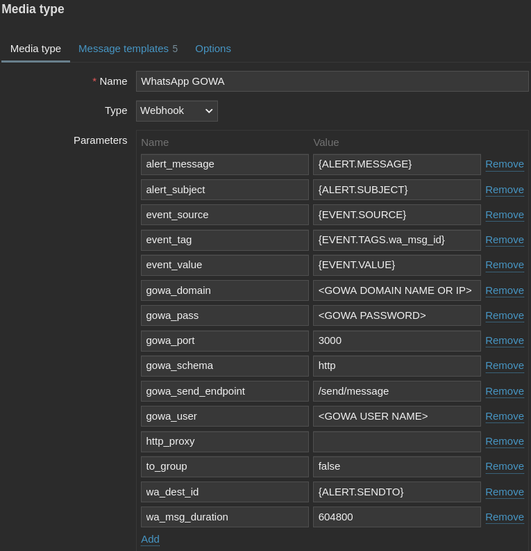
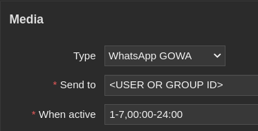
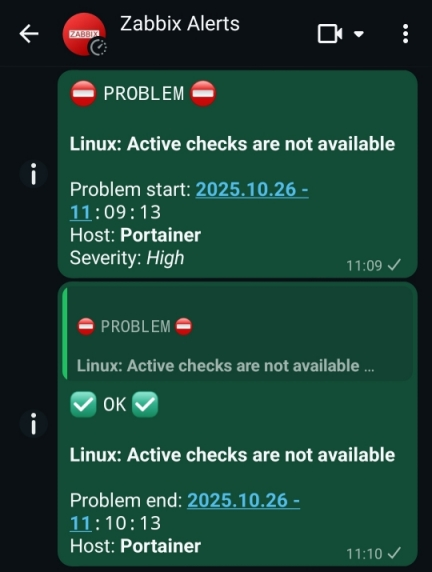

| [↩️ Back](../) |
| --- |

# Zabbix Whatsapp GOWA Media

[![License][license]](./../../LICENSE) [![Version][version]](./zabbix_whatsapp_gowa_media_v743.yaml)

 

## OVERVIEW

This is a simple media type that integrates Zabbix to [**WhatsApp GOWA**][wa_gowa] gateway. It facilitates the transmission of WhatsApp notifications and alerts to particular users or groups via the GOWA REST API. 

This media type primarily focuses on trigger alerts and uses a webhook to communicate with the GOWA API. **Only simple messages** are sent when an event triggers an action. Additionally, when the an event is resolved, the recovery message replies to the previous problem message of the same event.

> _Pull requests are welcomed for further webhook development._

 

### Requirements

- [Whatsapp GOWA][wa_gowa] environment is active and **authenticated** to a WhatsApp account.

> ⚠️ **Note that GOWA uses "basic" authentication, which may not be secure enough. It is advisable to secure your environment with an additional security method.**

 

---
### ➡️ [Download](./zabbix_whatsapp_gowa_media_v743.yaml)
---
#### ➡️ [*How to import templates*][import_media]
---

 

## CONFIGURABLE PARAMETERS

> These configurable parameters are intended to be adjusted according to the webhook setup, the user's preferences, and the environment.

| Name                 | Default Value              | Description |
| :------------------- | :------------------------: | :---------- |
| `gowa_domain`        | `<GOWA DOMAIN NAME OR IP>` | GOWA's endpoint domain name or IP address to which Zabbix should send the webhook request. |
| `gowa_pass`          | `<GOWA PASSWORD>`          | GOWA's authentication password. |
| `gowa_port`          | `3000`                     | GOWA's endpoint TCP connection port. |
| `gowa_schema`        | `http`                     | GOWA's URL **`http`** or **`https`** schema. |
| `gowa_user`          | `<GOWA USER NAME>`         | GOWA's authentication username. |
| `http_proxy`         | `<SET ONLY IF PROXYED>`    | **Empty by default**. Set if your environment requires a proxy connection. Format: `[protocol://][username[:password]@]domain.name[:port]`. See [HTTP agent proxy configuration][http_proxy]. |
| `to_group`           | `false`                    | `false` sends the message to a user ID. Set this to `true` if your destination WhatsApp ID is a group. |
| `wa_msg_duration`    | `604800`                   | This is the temporary WhatsApp message time limit in seconds (**7 days** by default). After this time, the message is removed. Set to `0` or leave blank to remove the time limit. |

 

## INTERNAL PARAMETERS

> Internal parameters are reserved for predefined macros or values that are not typically meant to be modified.

| Name                 | Default Value              | Description |
| :------------------- | :------------------------: | :---------- |
| `alert_message`      | `{ALERT.MESSAGE}`          | Default message value. This value can be set by the media message template or the action custom message configuration. |
| `alert_subject`      | `{ALERT.SUBJECT}`          | Default subject value. This value can be set by the media message template or the action custom message configuration. |
| `event_source`       | `{EVENT.SOURCE}`           | Numeric value of the event source. Possible values are: `0` - Trigger, `1` - Discovery, `2` - Autoregistration, `3` - Internal, and `4` - Service. |
| `event_tag`          | `{EVENT.TAGS.wa_msg_id}`   | The event tag value referenced by the tag name. Expanded to an empty array if no tags exist. |
| `event_value`        | `{EVENT.VALUE}`            | Numeric value of the event that triggered an action (`1` for problem or `0` for recovery). |
| `gowa_send_endpoint` | `/send/message`            | GOWA's endpoint resource to which Zabbix should send the webhook request. This endpoint is for message sending only. |
| `wa_dest_id`         | `{ALERT.SENDTO}`           | The "_Send to_" value from the user media configuration. |

 

## SETUP

1. Set up the [WhatsApp GOWA gateway][wa_gowa] with a username and password.
2. In GOWA's interface, log in to the WhatsApp account that will send messages.
3. Search for and take note of the user or group ID that will receive the messages. This data can be found in the "List Group" or "Chat List" options.
4. Proceed to Zabbix and go to the `Alerts` > `Media types` menu.
5. [Import the GOWA media type](#-download).
6. Open the WhatsApp GOWA media type configuration and set up its parameters according to your environment.
    a. Set up the GOWA URL schema by filling in the `gowa_schema` parameter.
    b. Set up the GOWA URL domain name by filling in the `gowa_domain` parameter.
    c. Set up the GOWA URL port number by filling in the `gowa_port` parameter.
    d. Set up the GOWA authentication username and password by filling in the `gowa_user` and `gowa_pass` parameters, respectively.
    e. If the destination WhatsApp ID is a group, set the `to_group` parameter to `true`. Otherwise, leave it as `false`.
    f. The `wa_msg_duration` parameter is set to **7 days** (_604800 seconds_) by default. If desired, set it to a different value of your choosing. Set it to `0` or leave it blank to remove the time limit.
    g. If a HTTP proxy connection is required, set the proxy URL in the format of `[protocol://][username[:password]@]domain.name[:port]`. See the [HTTP agent proxy configuration][http_proxy].
    
7. You can optionally further customize the WhatsApp messages in the `Media templates` tab.
8. Make sure your media type is enabled.
9. Go to the `Users` > `Users` menu option and [create or edit the destination user][user_config].
    a. In the user's `Media` tab, add the WhatsApp GOWA media type.
    b. Add the user or group ID to the `Send to` field.
    
10. After setting up the media type, you can [create actions][create_actions] using the `Send message` operation with the WhatsApp GOWA media type.

 

## MESSAGE EXAMPLE

 

## TEST

This media type has only been tested with Zabbix 7.4 and WhatsApp GOWA 7.8.0. However, it should be compatible with either versions 7 and later.

 

| [⬆️ Top](#zabbix-whatsapp-gowa-media) |
| --- |

[wa_gowa]: https://github.com/aldinokemal/go-whatsapp-web-multidevice
[license]: https://img.shields.io/badge/License-GPL3-blue?logo=opensourceinitiative&logoColor=fff
[version]: https://img.shields.io/badge/Version-743-blue?logo=zotero&color=0aa8d2
[import_media]: https://www.zabbix.com/documentation/current/en/manual/xml_export_import/media
[http_proxy]: https://www.zabbix.com/documentation/current/en/manual/config/items/itemtypes/http#configuration
[create_actions]: https://www.zabbix.com/documentation/current/en/manual/config/notifications/action
[user_config]: https://www.zabbix.com/documentation/current/en/manual/config/users_and_usergroups/user