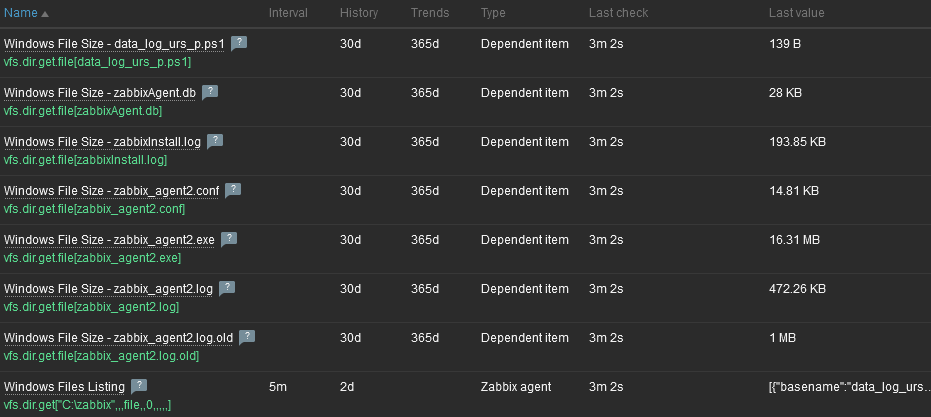

| [↩️ Back](./) |
| --- |

# Zabbix Template for Windows Files Discovery

 

## Overview

[Some Zabbix users](https://www.zabbix.com/forum/zabbix-help/486606-flexible-template-for-monitoring-multiple-files) need to monitor multiple files from the file systems of their monitored hosts. This is not difficult in itself, as it is possible to create a template and assign it to a host. However, it can happen that you need to monitor several files in different directories on a system.

It would be nice if this could be handled by a discovery rule with its corresponding item prototypes, similar to the discovery of Windows services.

At first glance, you might think that there are no possible keys to find multiple files that span to multiple directories. After all, the `vfs.file.get` item key can only handle one file, and `vfs.dir.get` can only traverse one directory, which in principle makes sense. But note that "_traverse_" is the key word. `vfs.dir.get` key can traverse a directory. So the higher up you go in a file system tree, the broader you can traverse.

This is a simple template that discovers multiple files in a directory. It is based on the `vfs.dir.get` item key, which returns the file sizes right away, and some macros to make it somewhat flexible. Of course, you will need to customize it for your own scenario, and for files in different directories, you will need some flexible regular expressions. Macros are provided for such flexibility.

 

## Requirements

- Template for Zabbix 7.0 or higher
- Windows Zabbix Agent 6.0 or higher

 

---
### ➡️ [Download](./windows_file_by_zabbix_agent.yaml)
---
#### ➡️ [*How to import templates*](https://www.zabbix.com/documentation/current/en/manual/xml_export_import/templates#importing)
---

 

### MACROS

| Macro                     | Default Value | Description |
| ------------------------- | ------------- | ----------- |
| {$ENTRY.DIR.PATH}         |               | Directory absolute path to be searched. Set at host level |
| {$ENTRY.DIR.NOT_MATCHES}  |               | Regex for directory **NOT** to be searched |
| {$ENTRY.MAX.DEPTH}        | 0             | **N** maximum depth of subdirectories to traverse. **-1** = unlimited, **0** = no descending into subdirectories. |
| {$ENTRY.NAME.MATCHES}     |               | File names to be listed. All if empty |
| {$ENTRY.NAME.NOT_MATCHES} |               | File names **NOT** to be listed |
| {$ENTRY.TYPE.MATCHES}     | file          | Type of entry to be listed. See doc for more types |
| {$ENTRY.TYPE.NOT_MATCHES} |               | Type of entry **NOT** to be listed |

 

### ITEMS

| Name                  |
| --------------------- |
| Windows Files Listing |

 

### DISCOVERY RULE

| Name                   |
| ---------------------- |
| Windows File Discovery |

 

### ITEM PROTOTYPES

| Name                                                   |
| ---------------------------------- |
| Windows File Size - {\#ENTRY.NAME} |

 

### SAMPLE

 

| [⬆️ Top](#zabbix-template-for-windows-files-discovery) |
| --- |
