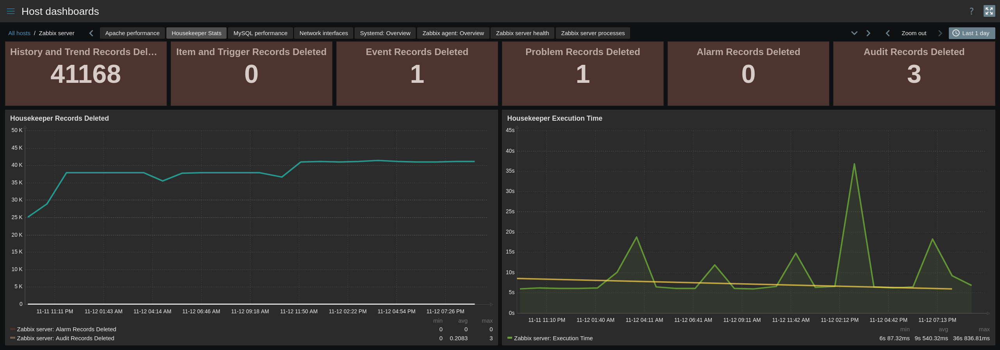

| [↩️ Back](../) |
| --- |

# Zabbix Housekeeper Stats Template

 

 

## OVERVIEW

This is a simple template that checks the records deleted by the Housekeeper process and its execution time.

 

### Requirements

- Active Zabbix Agent in the Zabbix Server host.

 

---
### ➡️ [Download](./zabbix_housekeeper_template_v722.yaml)
---
#### ➡️ [*How to import templates*](https://www.zabbix.com/documentation/current/en/manual/xml_export_import/templates#importing)
---

 

## MACROS USED

| Macro                    | Default Value | Description |
| :----------------------- | :-----------: | :---------- |
| {$HOUSEKEEPER.EXEC.WARN} | 60            | Time limit in seconds for Housekeeper execution time warning |

 

## ITEMS

| Name |
| :--- |
| Housekeeper Log Statistics |
| Housekeeper Log Statistics: Alarm Records Deleted |
| Housekeeper Log Statistics: Audit Records Deleted |
| Housekeeper Log Statistics: Autoregistration Host Records Deleted |
| Housekeeper Log Statistics: Event Records Deleted |
| Housekeeper Log Statistics: Execution Time |
| Housekeeper Log Statistics: History and Trend Records Deleted |
| Housekeeper Log Statistics: Item and Trigger Records Deleted |
| Housekeeper Log Statistics: Problem Records Deleted |
| Housekeeper Log Statistics: Records Deleted |
| Housekeeper Log Statistics: Session Records Deleted |

 

## TRIGGERS

| Name |
| :--- |
| Housekeeper execution time is High |

 

## DASHBOARD

| Name |
| :--- |
| Housekeeper Stats |

 

## DASHBOARD EXAMPLE

 

| [⬆️ Top](#zabbix-housekeeper-stats-template) |
| --- |