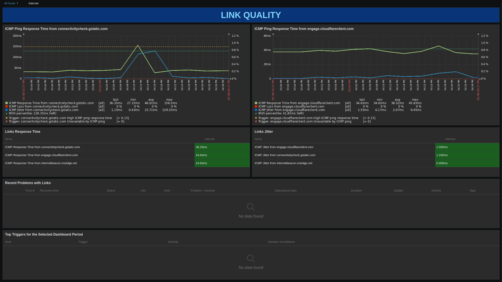

| [↩️ Back](../) |
| --- |

# Link Quality by Simple Check Zabbix Template

 

## OVERVIEW

This template provides a method for checking the reliability of multiple links. It provides simple ICMP items that offer an overview of a link's connectivity, performance, and degradation. These indicators provide a basic measure of the quality and reliability of the target link. It is based on the OOTB "_ICMP Ping_" template and enhanced to receive a list of ICMP targets.

A manual address list is configured for each host to obtain the ICMP destinations, then Zabbix sends the list to an LLD rule which dynamically creates simple ICMP items for each address. It is primarily designed for Internet links, but can be used for most types of links, such as WAN, LAN and VPN.

 

### REQUIREMENTS

- Since the discovered items are Simple Checks, the Zabbix Server/Proxy must be allowed to ping the destination target.
- If DNS names are used, the Zabbix Server/Proxy must be able to resolve them.
- The target list requires 2 macros: one for target addresses and another for target names. **The order of these macro values should match.**

 

### SETUP

1. The template's `{$ICMP.LIST.ADDRESS}` and `{$ICMP.LIST.NAME}` macros are empty by default and are intended for **host-level configuration**.
2. ⚠️ Configure the `{$ICMP.LIST.ADDRESS}` macro with IPs or DNS addresses separated by commas (**`,`**).
    - **Example**: `1.2.3.4,5.6.7.8,target.domain,public.com`
3. ⚠️ Configure the `{$ICMP.LIST.NAME}` macro with names separated by commas (**`,`**) to better describe the target addresses.
    - **Example**: `First,Fifth,Private Domain,Public`
4. The master item is updated once a day to reflect any changes in the host macro.
    - If the macro is changed, it is possible to run the "_Execute Now_" command and update the list. This will execute the discovery rule.

> Below are some of the major BigTech domains that are commonly used to test Internet connectivity.

> - Google - `connectivitycheck.gstatic.com`
> - Cloudflare - `engage.cloudflareclient.com`
> - Microsoft - `internetbeacon.msedge.net`

> 💡 _I'm looking for more BigTech **public** addresses that are specific for conectivity checks, like captive portal or beacon addresses (Amazon, Apple, banks, Cisco, Meta, Netflix, NVidia, Tesla, etc). If you know any, please report them in the issues tab._

 

---

### ➡️ [Download](./link_quality_template_v745.yaml)

---

#### ➡️ [*How to import templates*](https://www.zabbix.com/documentation/current/en/manual/xml_export_import/templates#importing)

---

 

## MACROS USED

| Macro                | Default Value | Description |
| :------------------- | :-----------: | :---------- |
| {$ICMP.LIST.ADDRESS} |               | Comma-separated list of ICMP destination addresses. DNS names are valid if your Zabbix Server can resolve them. |
| {$ICMP.LIST.NAME}    |               | Comma-separated list of respective names for the ICMP destination addresses. |
| {$ICMP.LATENCY.WARN} | `0.15`        | ICMP RTT latency warning timeout in seconds. |
| {$ICMP.LOSS.WARN}    | `25`          | ICMP packet loss percentage for warning threshold. Default of 4 packets sent gives a rounding rate of 25, 50, 75 or 100. |
| {$ICMP.REPEAT.COUNT} | `4`           | Number of ICMP packets sent to the destination address. |
| {$ICMP.TIMEOUT}      | `200`         | RTT timeout of each ICMP packet in miliseconds. |
| {$ICMP.WAN.ALERT}    | `1`           | Control weather the WAN link is important or not. 1 to activate and 0 to deactivate. No WAN event will be triggered if this is 0. |

> - **The default values can be very conservative and sensitive, and it is recommended that you customize them for your own environment.**
> - **Threshold macros have context and can be set to individual addresses on a host-level.**

 

## ITEMS

| Name                  | Description |
| :-------------------- | :---------- |
| ICMP Address List     | This item accepts a comma-separated list of ICMP destination addresses and their respective names. It then converts it to a JSON array. This array is used by the ICMP Address Discovery rule to dynamically create items. |
| ICMP Link Latency Sum | This item sums the most recent latency values of all target links. This sum is primarily used to determine the availability of the WAN link. |

 

## TRIGGERS

| Name                              | Description |
| :-------------------------------- | :---------- |
| ICMP Link Latency Sum Unavailable | The average of the last 2 link sums is 0. This means that all the target links have a latency of 0, which indicates that the WAN link may be unavailable. This supersedes the prototype triggers. If the hosts `{$ICMP.WAN.ALERT}` macro is set to `0`, this trigger is ignored. |

 

## DISCOVERY RULE

| Name                   | Description |
| ---------------------- | :---------- |
| ICMP Address Discovery | This LLD takes the master item JSON array of ICMP destination addresses and converts it to an LLD JSON array. This array is looped through to dynamically create host items for each address in the array. |

 

## ITEM PROTOTYPES

| Name                                      | Description |
| :---------------------------------------- | :---------- |
| ICMP Jitter from `{#ICMP.ADDRESS.NAME}`        | ICMP response time variation from `{#ICMP.ADDRESS.NAME}` - `{#ICMP.ADDRESS}` taking into account previous and latest value |
| ICMP Loss from `{#ICMP.ADDRESS.NAME}`          | ICMP percentage of packets lost from `{#ICMP.ADDRESS.NAME}` - `{#ICMP.ADDRESS}` |
| ICMP Response Time from `{#ICMP.ADDRESS.NAME}` | ICMP response time in seconds from `{#ICMP.ADDRESS.NAME}` - `{#ICMP.ADDRESS}` |

 

## TRIGGER PROTOTYPES

| Name                                           | Description |
| :--------------------------------------------- | :---------- |
| `{#ICMP.ADDRESS.NAME}` High ICMP loss               | Last and previous ICMP ping attempts returned at least `{$ICMP.LOSS.WARN}`% of packet loss, or the latest ICMP ping attempt returned more than `{$ICMP.LOSS.WARN}`% packet loss. |
| `{#ICMP.ADDRESS.NAME}` High ICMP ping response time | The last ICMP ping response time was higher than `{$ICMP.LATENCY.WARN}`s |
| `{#ICMP.ADDRESS.NAME}` Unavailable by ICMP ping     | The last two ICMP ping attempts to `{#ICMP.ADDRESS.NAME}` have timed out. |

 

## GRAPH PROTOTYPE

| Name                                           |
| :--------------------------------------------- |
| ICMP Ping Response Time from `{#ICMP.ADDRESS.NAME}` |

 

## DASHBOARD

| Name         |
| ------------ |
| Link Quality | 

 

## DASHBOARD EXAMPLE

---

 

| [⬆️ Top](#link-quality-by-simple-check-zabbix-template) |
| --- |