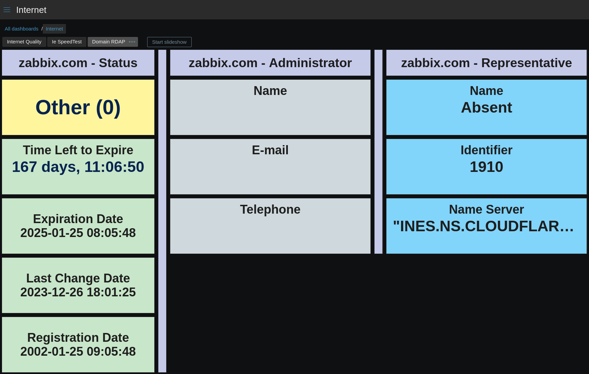

| [↩️ Back](./) |
| --- |

# Zabbix Template for Domain RDAP

 

 

## OVERVIEW

It may be useful to monitor a domain name registry using the [Registration Data Access Protocol (RDAP)](https://about.rdap.org/) (_RFC7480_).
This is a simple template that allows you to retrieve RDAP data about a domain name from a specified RDAP server.

 

### _REMARKS_

- By default, the template's main item queries the domain name data once a day. This is a conservative period in order to minimize the impact on the RDAP server and the Zabbix database.
- Depending on the server policy, RDAP queries may be logged along with the source IP address. **In addition, the query may be blocked by the server if abused.**
- Many domains have the representative entity set to the `abuse` role. This can indicate that the data is private. Therefore, the **representative and administrator items can have empty values**.
- **This template has been tested with many public domain names to cover various scenarios, but there are a wide variety of registries that could not be tested. So, specific domains may not work as expected, and should be customized individually. The issues tab is open for discussion.**

 

---
### ➡️ [Download](./domain_rdap_by_http.yaml)
---
#### ➡️ [*How to import templates*](https://www.zabbix.com/documentation/current/en/manual/xml_export_import/templates#importing)
---

 

## MACROS USED

| Macro                    | Default Value           | Description |
| ------------------------ | :---------------------: | ----------- |
| {$RDAP.DOMAIN.NAME}      |                         | Domain name to query |
| {$RDAP.EXPIRY.THRESHOLD} | 60                      | Threshold for domain to expire in days |
| {$RDAP.URL}              | https://rdap.org/domain | The RDAP server URL |

 

## ITEMS

| Name |
| ---- |
| RDAP Domain Registry JSON |
| Domain Time to Expire |
| RDAP Domain Registry JSON: Domain Status |
| RDAP Domain Registry JSON: Domain Representative Identifier |
| RDAP Domain Registry JSON: Domain Name Server |
| RDAP Domain Registry JSON: Domain Legal Representative Name |
| RDAP Domain Registry JSON: Domain Date Registration |
| RDAP Domain Registry JSON: Domain Date Last Changed |
| RDAP Domain Registry JSON: Domain Date Expiration |
| RDAP Domain Registry JSON: Domain Administrator Telephone |
| RDAP Domain Registry JSON: Domain Administrator Name |
| RDAP Domain Registry JSON: Domain Administrator Email |

 

## TRIGGERS

| Name |
| ---- |
| Domain Administrator Contact Changed |
| Domain Expires Soon |
| Domain Nameserver Changed |
| Domain Representative Changed |
| Domain Status is Different than Active |
| Domain was Recently Changed |

 

## DATA EXAMPLE

---

 

## DASHBOARD EXAMPLE

 

| [⬆️ Top](#zabbix-template-for-domain-rdap) |
| --- |