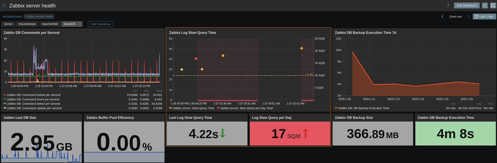
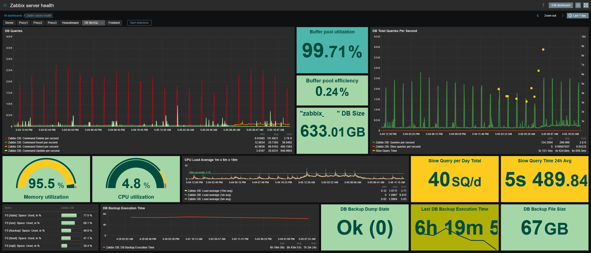

| [↩️ Back](../) |
| --- |

# Template for Zabbix Server Slow Query Stats by Zabbix Agent Active

 

## OVERVIEW

Zabbix Server constantly communicates with the backend database. When it detects a slow query, it creates a log record with the query SQL and the time taken. These values can be useful to see what kind of queries are having problems and can give a good insight into the database health.

This template collects the slow query statistics from the Zabbix Server log with the Zabbix Agent in active mode.

 

### REQUIREMENTS

1. Start the Zabbix Agent in active mode with the [`ServerActive` parameter](https://www.zabbix.com/documentation/current/en/manual/appendix/config/zabbix_agent2).
2. The [`LogSlowQueries` Zabbix Server parameter](https://www.zabbix.com/documentation/current/en/manual/appendix/config/zabbix_server) must be enabled (`>0`) for slow queries to be logged.

 

---
### ➡️ [Download](./zabbix_slow_query_template_v722.yaml)
---
#### ➡️ [*How to import templates*](https://www.zabbix.com/documentation/current/en/manual/xml_export_import/templates#importing)
---

 

## MACROS USED

| Macro                | Default Value                       | Description |
| :------------------- | :---------------------------------: | :---------- |
| `{$ZBX.LOG.PATH}`    | `/var/log/zabbix/zabbix_server.log` | Zabbix Server log absolute path. Change this value if it is different from the default |
| `{$SLOW.QUERY.WARN}` | `10`                                | Slow query daily count threshold for trigger warning |

> ⚠️ **The default slow query threshold is highly environment dependent and should be adjusted accordingly.**

 

## ITEMS

| Name                                       | Description |
| :----------------------------------------- | :---------- |
| Slow Query Log Statistics                  | Master item that collects slow query records from the Zabbix Server log |
| Slow Query Log Statistics: Slow Query SQL  | Zabbix slow query log recorded SQL query |
| Slow Query Log Statistics: Slow Query Time | Zabbix slow query log time in seconds |
| Slow Query per Day Commit                  | Zabbix slow query log count of commits per day |
| Slow Query per Day Delete                  | Zabbix slow query log count of deletes per day |
| Slow Query per Day Insert                  | Zabbix slow query log count of inserts per day |
| Slow Query per Day Update                  | Zabbix slow query log count of updates per day |
| Slow Query per Day Total                   | Zabbix slow query log total count per day |

 

## TRIGGERS

| Name                                | Description |
| :---------------------------------- | :---------- |
| High Number of Slow Queries per Day | The total amount of slow queries per day is higher than the threshold of `{$SLOW.QUERY.WARN}` |

 

## DASHBOARD EXAMPLE

---

 

| [⬆️ Top](#template-for-zabbix-server-slow-query-stats-by-zabbix-agent-active) |
| --- |