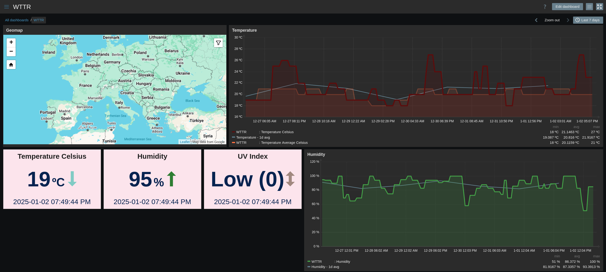

| [↩️ Back](../) |
| --- |

# Zabbix WTTR.in Template

 

 

## OVERVIEW

[WTTR.in](https://wttr.in) is a "_console-oriented weather forecast service that supports various information representation methods_". This is a Zabbix template that pulls weather information from WTTR.in for specific locations.

The data is retrieved in JSON format and stored in various items.

For more information, see [WTTR Help](https://wttr.in/:help) and [WTTR GitHub's](https://github.com/chubin/wttr.in).

 

### Requirements

- It is suggested to create a host for each location and [set the host interface](https://www.zabbix.com/documentation/current/en/manual/config/hosts/host) as the WTTR DNS address, something like `wttr.in`, or your own instance.

 

---
### ➡️ [Download](./wttr_http_template_v721.yaml)
---
#### ➡️ [*How to import templates*](https://www.zabbix.com/documentation/current/en/manual/xml_export_import/templates#importing)
---

 

## MACROS USED

| Macro              | Default Value | Description |
| :----------------- | :-----------: | :---------- |
| `{$WTTR_LANGUAGE}` | en            | Available languages:  |
| `{$WTTR_LOCATION}` |               | Place your location here. If empty, IP will be used to track the location. Multiple locations may be separated by comma. [`Latitude`,`Longitude`] supported. |
| `{$WTTR_UNIT}`     | m             | Unit types: `m`=metric (default), `u`=USCS, `M`=metric with m/s |

 

## ITEMS

| Name                                         | Description |
| :------------------------------------------- | :---------- |
| WTTR JSON                                    | WTTR raw JSON data for the provided location |
| WTTR JSON: Humidity                          | WTTR humidity estimates for the provided location |
| WTTR JSON: Temperature Average Celsius       | WTTR average temperature in Celsius for the provided location |
| WTTR JSON: Temperature Average Fahrenheit    | WTTR average temperature in Fahrenheit for the provided location |
| WTTR JSON: Temperature Celsius               | WTTR temperature in Celsius for the provided location |
| WTTR JSON: Temperature Fahrenheit            | WTTR temperature in Fahrenheit for the provided location |
| WTTR JSON: Temperature Feels Like Celsius    | WTTR Feels Like temperature in Celsius for the provided location |
| WTTR JSON: Temperature Feels Like Fahrenheit | WTTR Feels Like temperature in Fahrenheit for the provided location |
| WTTR JSON: UV Index                          | WTTR UV Index for the provided location |
| WTTR JSON: `{$WTTR_LOCATION}` Latitude       | The nearest latitude for the provided location, `{$WTTR_LOCATION}` |
| WTTR JSON: `{$WTTR_LOCATION}` Longitude      | The nearest longitude for the provided location, `{$WTTR_LOCATION}` |

 

## TRIGGERS

| Name               | Description |
| :----------------- | :---------- |
| UV Index High      | UV Index is High at the provided location |
| UV Index Very High | UV Index is very high at the provided location |

 

## DASHBOARD EXAMPLE

 

| [⬆️ Top](#zabbix-wttr-template) |
| --- |