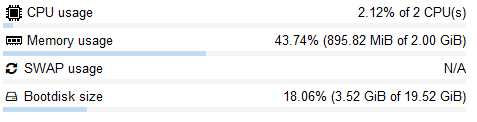

| [↩️ Back](./) |
| --- |

# ZABBIX PODMAN POD

Nowadays there are several reasons to use containers and some tools are available to manage them. [Podman](https://podman.io/) is such a tool, and besides Docker, it uses the [concept of Pods](https://kubernetes.io/docs/concepts/workloads/pods/), commonly used in Kubernetes.

Zabbix SIA provides Docker images for each Zabbix component to run as a portable and self-sufficient container. Also, Docker Compose files are also available to define and run multi-container Zabbix components in Docker. Since Podman can use Docker images, it is easy to port them to a Pod context. One can even use the Docker compose file to launch Zabbix containers. However, out-of-the-box Podman is not ready to run the Docker compose files.

There are multiple Zabbix components that are constantly communicating with each other. When deploying Zabbix components as containers, they must be tightly coupled and may need to share resources. With the Pod concept, these containers can form a single cohesive unit. So, to let Zabbix benefit from Podman's improvements, here's a simplified Pod proposal for Zabbix components in a Shell script format.

There are other differences between Podman and Docker, but this proposal is mainly intended for quick testing and development of Zabbix environments, while taking advantage of some of Podman's benefits.

<BR>

## Possible benefits

- ⭐ Rootless container environment
- ⭐ Container isolation and shared resources within a Pod

<BR>

## Requirements

> **Many distributions provide packages for Podman, including Windows.**

- 🛠️ [Install Podman](https://podman.io/docs/installation)
- 🛠️ [Basic setup](https://github.com/containers/podman/blob/main/docs/tutorials/podman_tutorial.md)
- 🛠️ [Rootless environment](https://github.com/containers/podman/blob/main/docs/tutorials/rootless_tutorial.md)

<BR>

---
### ➡️ [Script Download](./zabbixpod.sh)
---

<BR>

## Setup

1. Copy the script to your environment
2. Make the script executable
    - `chmod +x zabbixpod.sh`
3. With Podman running, start the script
    - `./zabbixpod.sh`
4. Access the Zabbix Frontend
    - `http://host.ip:8080`

<BR>

## The Script

⚠️
**The script has a number of variables to set up the Zabbix Pod environment. They can all be changed to suit your needs. However, it is recommended that you only change the first set of variables to avoid errors.**

> ```shell
> # CHANGE HERE IF REQUIRED
> ZBXMAJORVER="7"            # ZABBIX MAJOR VERSION
> ZBXMINORVER="0"            # ZABBIX MINOR VERSION
> DBROOTPASS="zabbix"        # DBMS ROOT PASSWORD
> DBNAME="zabbix"            # ZABBIX DATABASE PASSWORD
> DBUSER="zabbix"            # ZABBIX DATABASE USER
> DBPASS="zabbix"            # ZABBIX DATABASE PASSWORD
> OSTAG="ol"                 # OS BASE IMAGE TAG
>
> TIMEZ="Europe/Riga"        # CHANGE TO YOUR LOCAL TIMEZONE IN PHP FORMAT
> ```

<BR>

**1.** The script first creates a Pod called `zabbix[VERSION]pod`.

**2.** Most of the attributes that make up the Pod are assigned to the `infra` container and cannot be changed once it is created. It has some volumes are associated with it for the database, Zabbix Server and Agent files, allowing for some data persistence.

```shell
[user@host ~]$ tree zabbixpod/
zabbixpod/
├── agent
├── mysql
│   ├── conf
│   └── data
└── server
    ├── alertscripts
    ├── externalscripts
    └── snmptraps
```

**3.** The Pod also binds some ports for Zabbix to receive connections.
- `8080/TCP` for Web access to Zabbix Frontend.
- `10051/TCP` for hosts to connect to Zabbix Server.
- `1162/UDP` for Zabbix to receive SNMP traps.

**4.** Following the Pod, a MySQL container is created. It is not binded to a routable network accessible from outside the Pod. Its credentials are set in the first variable set.

**5.** Next, Zabbix component containers are created all binded to the `localhost` address of the Pod as a shared network name space. They are:

- `Zabbix Server`
- `Zabbix Web Frontend`
- `Zabbix SNMPTraps`
- `Zabbix Web Service`
- `Zabbix Agent 2`

**6.** The first time the Pod is launched, it may take about 2 minutes to be able to access the Zabbix Frontend while the database is being created.

<BR>

## Test

In a small environment, very few resources are required to run this type of Pod, as shown in the image below. However, long-term stability has not been verified, and your mileage may vary depending on your needs.



For testing purposes, let's create an environment to run the Zabbix Pod.

<BR>

### Environment

> _As of this writing, I'm testing with Zabbix 7.0 LTS._

🧪 **`Oracle Linux Server 9.4`**

🧪 **`Podman 4.9.4-rhel`**

<BR>

### Execution

Run the script (`./zabbixpod.sh`), and then it will create the containers inside the Pod. If the images are not found locally, Podman will download them, just like Docker.

```
[user@host ~]$ ./zabbixpod.sh
436244a5c23927504da3626b4ee17122b79dc9660dc0b0f727bc52da3b682d6b
c6730b91fcdba7fbf57a86e7a16cd33a27e9ae75959668f04bbe9a68d4b251bd
e50937e52cd3b17b0625c5d787cb950fadd271e5779f5fb3b7a66ac9152a0363
99d5d574e4daba6de9059fc3c158031e0ff70b247a73b7c97c02d1ae7ee54402
21e08aef7a62a5849518bcf9c3c40a2f8c0e96ce1bdc164e0d7ca00805c03a7b
64cf276876753ee5263ddfe7f1f7ea4543b27e2cab072213580494e5914ff5e0
517a0b914587335e322b86b146040bceb37b6b56f719dfa03b0edb3044f1a373
```

To confirm the Pod execution, just list it (`podman pod list`) and its containers (`podman ps -ap`).

```
[user@host ~]$ podman pod list
POD ID        NAME         STATUS      CREATED        INFRA ID      # OF CONTAINERS
b399fe5e8f50  zabbix70pod  Running     9 minutes ago  a41c40bfb700  7

[user@host ~]$ podman ps -ap
CONTAINER ID  IMAGE                                                  COMMAND               CREATED        STATUS        PORTS                                                                    NAMES                     POD ID        PODNAME
5de8e984bdf5  localhost/podman-pause:4.9.4-rhel-1718143542                                 4 seconds ago  Up 5 seconds  0.0.0.0:8080->8080/tcp, 0.0.0.0:10051->10051/tcp, 0.0.0.0:1162->162/udp  zabbix70pod-infra         436244a5c239  zabbix70pod
c6730b91fcdb  docker.io/library/mysql:lts                            --character-set-s...  4 seconds ago  Up 4 seconds  0.0.0.0:8080->8080/tcp, 0.0.0.0:10051->10051/tcp, 0.0.0.0:1162->162/udp  zabbix70-mysql            436244a5c239  zabbix70pod
e50937e52cd3  docker.io/zabbix/zabbix-server-mysql:ol-7.0-latest     /usr/sbin/zabbix_...  4 seconds ago  Up 4 seconds  0.0.0.0:8080->8080/tcp, 0.0.0.0:10051->10051/tcp, 0.0.0.0:1162->162/udp  zabbix70-server           436244a5c239  zabbix70pod
99d5d574e4da  docker.io/zabbix/zabbix-web-nginx-mysql:ol-7.0-latest                        3 seconds ago  Up 4 seconds  0.0.0.0:8080->8080/tcp, 0.0.0.0:10051->10051/tcp, 0.0.0.0:1162->162/udp  zabbix70-web-nginx-mysql  436244a5c239  zabbix70pod
21e08aef7a62  docker.io/zabbix/zabbix-snmptraps:ol-7.0-latest        /usr/sbin/snmptra...  3 seconds ago  Up 4 seconds  0.0.0.0:8080->8080/tcp, 0.0.0.0:10051->10051/tcp, 0.0.0.0:1162->162/udp  zabbix70-snmptraps        436244a5c239  zabbix70pod
64cf27687675  docker.io/zabbix/zabbix-web-service:ol-7.0-latest      /usr/sbin/zabbix_...  3 seconds ago  Up 3 seconds  0.0.0.0:8080->8080/tcp, 0.0.0.0:10051->10051/tcp, 0.0.0.0:1162->162/udp  zabbix70-web-service      436244a5c239  zabbix70pod
517a0b914587  docker.io/zabbix/zabbix-agent2:ol-7.0-latest           /usr/sbin/zabbix_...  3 seconds ago  Up 3 seconds  0.0.0.0:8080->8080/tcp, 0.0.0.0:10051->10051/tcp, 0.0.0.0:1162->162/udp  zabbix70-agent2           436244a5c239  zabbix70pod
```

> **Note that the Pod was created under a non-privileged user (`~`) and all data is stored this user's home directory.**

<BR>

| [⬆️ Top](#zabbix-podman-pod) |
| --- |
