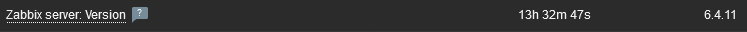
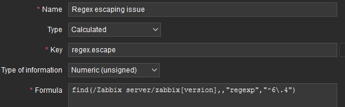
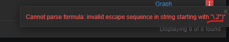

| [↩️ Back](../) |
| --- |

# Zabbix invalid Regular Expression due to escaping character

It has been reported in the [Zabbix forums](https://www.zabbix.com/forum/zabbix-help/455002-zabbix-6-regexp-incorrect-expression-6-0) and on the [support platform](https://support.zabbix.com/browse/ZBX-21998) that when using a function with a regular expression that escapes a character, Zabbix displays an incorrect parameter error.
So, let's dive into the problem.

<BR>

> **Fixed 🎉**
> 
> This problem was fixed in [issue ZBX-21898](https://support.zabbix.com/browse/ZBX-21898). \
> Updated documentation:
> - [Escaping examples](https://www.zabbix.com/documentation/current/en/manual/appendix/escaping)
>
> Testing with Zabbix `6.4.11`, it now works as expected.

<BR>

## Reproducing the issue

When using the `find` function with a regular expression and trying to escape a period (**.**) character, Zabbix displays an incorrect parameter error. Using the `Zabbix server: Version` item as an example, we can verify this behavior.

**1.** First, we can see that the Zabbix Server version item has the string `6.4.11`.


**2.** When attempting to create a calculated item that searches this string, Zabbix displays an incorrect expression error if the backslash escape character (**\\**) is used with the period (**.**) character.
```
find(/Zabbix server/zabbix[version],,"regexp","^6\.4")
```


```
Cannot update trigger
Invalid parameter "/1/expression": incorrect expression starting from "find(/zbxproxy/zabbix[version],,"regexp","^6\.4")=0".
```


<BR>

The same thing happens when you try to create or update a trigger.
```
Cannot update trigger
Invalid parameter "/1/expression": incorrect expression starting from "find(/zbxproxy/zabbix[version],,"regexp","^6\.4")=0".
```

> Despite the invalid Zabbix parameter, this [simple regular expression (`^6\.4`)](https://regex101.com/r/toKR96/1) is compatible with PCRE.

<BR>

**3.** The expression is considered valid if two backslashes are used, but the result is false (`= 0`) because the actual backslash character is escaped.
```
find(/APP Zabbix Proxy/zabbix[version],,"regexp","^6\\.4")
```

Removing the escape character (**\\**) also makes the expression valid. This is because the period character is interpreted as "_any character_".
```
find(/APP Zabbix Proxy/zabbix[version],,"regexp","^6.4")
```

It also accepts brackets between the period character.
```
find(/APP Zabbix Proxy/zabbix[version],,"regexp",'^6[.]2')
```

<BR>

**4.** I've also tried messing with Zabbix DB to force the backslash character in the expression. \
My test item has the following parameter in Zabbix DB after creating it without the backslash character.
```sql
mysql> select params from items where itemid=44280;
+--------------------------------------------------+
| params                                           |
+--------------------------------------------------+
| find(/zbxproxy/zabbix[version],,"regexp","^6.4") |
+--------------------------------------------------+
```

Forcing an update in the item's "**params**" column results in an unsupported item.
```sql
mysql> update items set params='find(/zbxproxy/zabbix[version],,"regexp","^6\\.4")' where itemid=44280;
Query OK, 1 row affected (0.01 sec)
```
```sql
mysql> select params from items where itemid=44280;
+---------------------------------------------------+
| params                                            |
+---------------------------------------------------+
| find(/zbxproxy/zabbix[version],,"regexp","^6\.4") |
+---------------------------------------------------+
```

Unfortunately, after the change, the frontend displays the following error.
```
Cannot parse formula: invalid escape sequence in string starting with "\.4")"
```

> _In addition to the period (**.**), this problem seems to occur with other characters as well._

<BR>

---

**The expected behavior is for the regular expression to find the literal characters escaped by the backslash.**

**This test shows that the regular expression escaping does not behave as expected.**

---

<BR>

### References

- [Forum- Zabbix 6 regexp: incorrect expression "6\.0"](https://www.zabbix.com/forum/zabbix-help/455002-zabbix-6-regexp-incorrect-expression-6-0)
- [Issue ZBX-21998](https://support.zabbix.com/browse/ZBX-21998)
- [Issue ZBX-21898](https://support.zabbix.com/browse/ZBX-21898)

<BR>

| [⬆️ Top](#zabbix-invalid-regular-expression-due-to-escaping-character) |
| --- |
